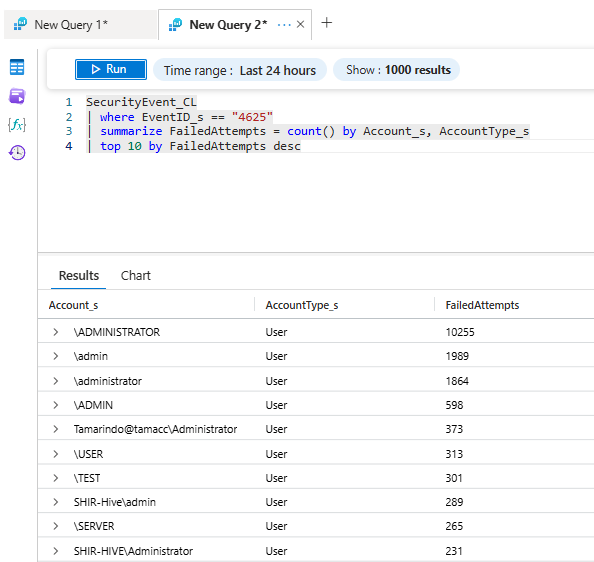
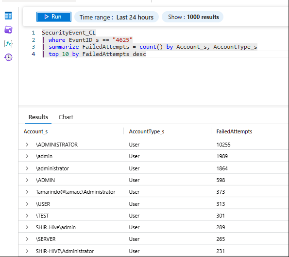
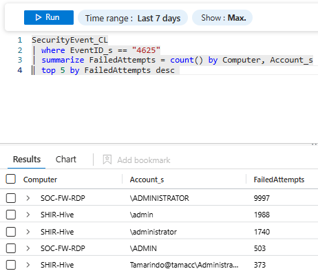
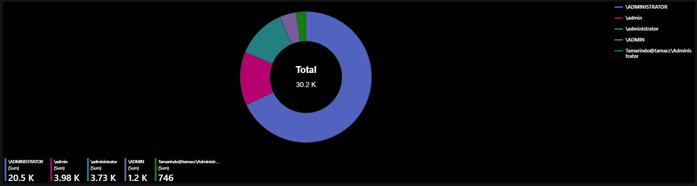
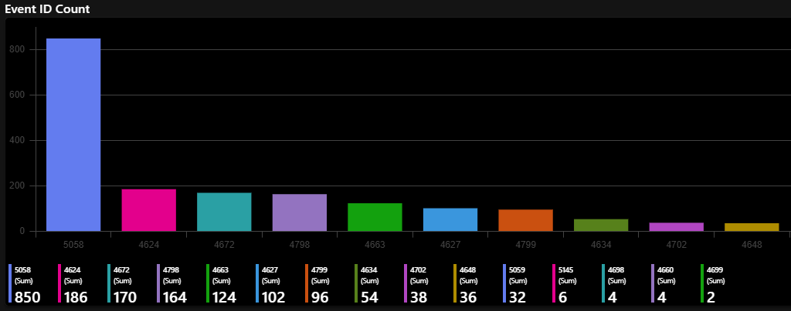
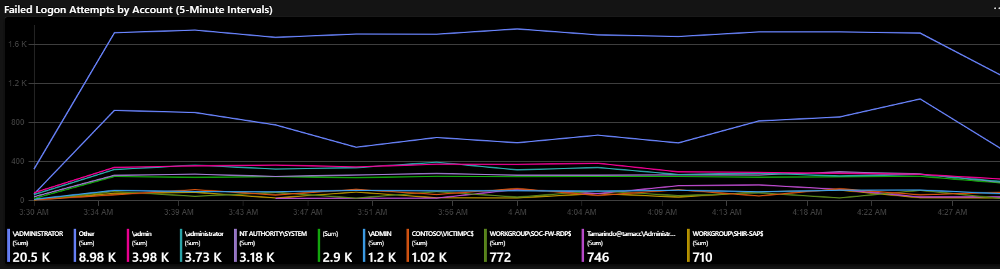
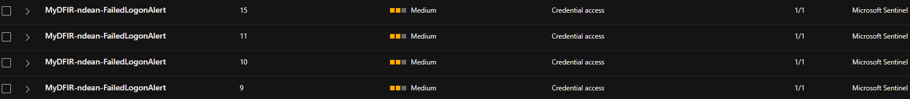
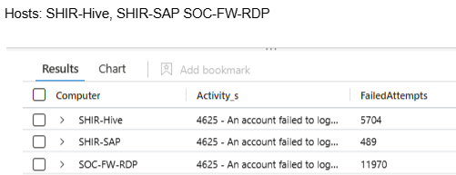
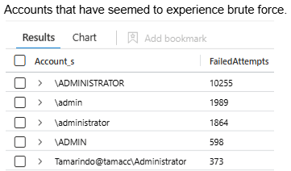
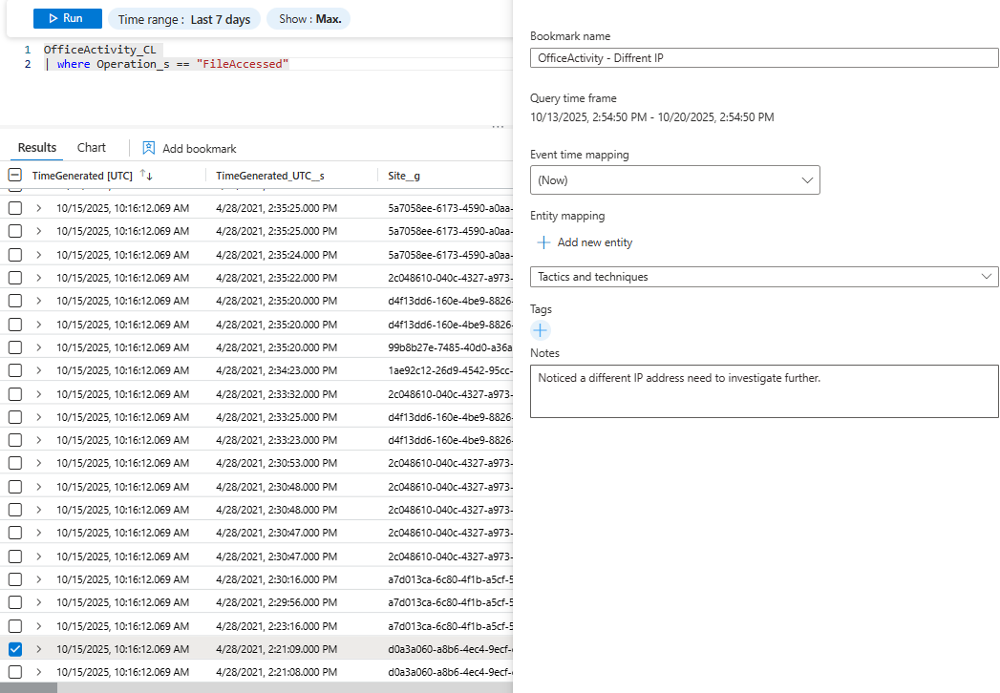

# Microsoft-30Day-SOC-Challenge
A 30-day journey through real-world SOC operations using Microsoft security tools. Includes KQL queries, incident response workflows, and reflections on building modern cloud detections.

## Overview
This repository documents my journey through the **MyDFIR Microsoft 30-Day SOC Analyst Challenge**, where I built, configured, and analyzed a Microsoft SOC environment using **Sentinel**, **Defender XDR**, and **Entra ID**.


# Table of Contents

- [Day 1 – Lab Setup and Planning](#day-1---lab-setup-and-planning)
- [Day 2 – Virtual Machine Setup](#day-2---virtual-machine-setup)
- [Day 3 – Microsoft Sentinel Workspace Overview](#day-3---microsoft-sentinel-workspace-overview)
- [Day 4 – KQL Queries](#day-4---kql-queries)
- [Day 5 – Dashboard Creation](#day-5---dashboard-creation)
- [Day 6 – Alert and Incident Creation](#day-6---alert-and-incident-creation)
- [Day 7 – Incident Investigation Report](#day-7---incident-investigation-report)
- [Day 8 – Bookmark and Manual Incident Creation](#day-8---bookmark--manual-incident) 
- [Day 9 – Microsoft Defender for Endpoint Overview](#day-9---microsoft-defender-for-endpoint-overview)
- [Day 10 – Device Inventory and Exposure Management](#day-10---device-inventory-and-exposure-management)
- [Day 11 – Defender Alerts and Notifications](#day-11---defender-alerts-and-notifications)
- [Day 12 – Automated Investigations](#day-12---automated-investigations)
- [Day 13 – Live Response and Evidence Collection](#day-13---live-response-and-evidence-collection)
- [Day 14 – Attack Surface Reduction Rules](#day-14---attack-surface-reduction-rules)
- [Day 15 – Endpoint Detection Deep Dive](#day-15---endpoint-detection-deep-dive)
- [Day 16 – Threat Hunting with KQL](#day-16---threat-hunting-with-kql)
- [Day 17 – Custom Detection Rules](#day-17---custom-detection-rules)
- [Day 18 – Advanced Hunting Queries](#day-18---advanced-hunting-queries)
- [Day 19 – Defender Antivirus and Remediation](#day-19---defender-antivirus-and-remediation)
- [Day 20 – Network Protection and EDR Block Mode](#day-20---network-protection-and-edr-block-mode)
- [Day 21 – Entra ID and Identity Protection Overview](#day-21---entra-id-and-identity-protection-overview)
- [Day 22 – Sign-In Logs and Risky User Detection](#day-22---sign-in-logs-and-risky-user-detection)
- [Day 23 – Conditional Access and MFA Enforcement](#day-23---conditional-access-and-mfa-enforcement)
- [Day 24 – Identity Alerts and Incident Correlation](#day-24---identity-alerts-and-incident-correlation)
- [Day 25 – Conditional Access Policy Testing](#day-25---conditional-access-policy-testing)
- [Day 26 – Defender for Cloud Apps Overview](#day-26---defender-for-cloud-apps-overview)
- [Day 27 – Endpoint and Identity Visibility Reflection](#day-27---endpoint-and-identity-visibility-reflection)
- [Day 28 – SOC Process and Triage Workflow](#day-28---soc-process-and-triage-workflow)
- [Day 29 – Final Mini Project Submission](#day-29---final-mini-project-submission)


## Day 1 - Lab Setup and Planning

**Objective:**  
Create an Azure account, set up billing alerts, and define a resource naming convention.  
Plan out the lab structure and goals for the 30-Day Challenge.

**Tasks Completed:**  
- Created Microsoft Azure account and configured billing alert thresholds.  
- Defined resource naming convention (e.g., MyDFIR-Dean-Sentinel).  
- Outlined lab plan and estimated completion schedule.  

**Reflection:**  
Setting up the environment helped me understand Azure cost management and resource organization.  

## Day 2 - Virtual Machine Setup

**Objective:**  
Create a virtual machine in Azure or on-premises for use in the SOC lab.

**Tasks Completed:**  
- Deployed Windows 10 VM for endpoint simulation.  
- Configured network settings and baseline security policies.  
- Verified connectivity to Microsoft Sentinel workspace.  

**Reflection:**  
Learned how to spin up and secure virtual machines for monitoring and testing.  
  
## Day 3 - Sentinel Workspace Overview

**Objective:**  
Explore the Sentinel interface and familiarize with its tabs, features, and capabilities.

**Tasks Completed:**  
- Reviewed **Overview**, **Incidents**, **Logs**, **Hunting**, and **Workbooks** tabs.  
- Captured initial dashboard screenshot for future portfolio use.  

**Reflection:**  
Understanding Sentinel’s UI made it easier to navigate during later assignments.  
 
# Day 4 - KQL Queries

## Objective
Use KQL to query Microsoft Sentinel logs and identify authentication failures, event trends, and host activity patterns to strengthen detection and analysis capabilities.

---

## Tools & Concepts
- Microsoft Sentinel  
- Log Analytics Workspace  
- KQL (Kusto Query Language)  
- EventID 4625 (Failed Logon Events)  
- SOC Analysis & Detection

---

## Query 1 - Top Accounts with Failed Logons
```kql
SecurityEvent_CL
| where EventID_s == "4625"
| summarize FailedAttempts = count() by Account_s, AccountType_s
| top 10 by FailedAttempts desc
```
### Purpose:
Identify which accounts have the highest number of failed login attempts.
### Why It’s Important:
This helps detect brute-force or password-spraying attacks targeting user or admin accounts.


### Observation:
Administrator accounts had an unusually high number of failed attempts, indicating potential credential-stuffing activity.

## Query 2 - Most Common Event IDs (Frequency Analysis)
```
SecurityEvent_CL
| summarize RandomCount = count() by EventID_s
| sort by RandomCount desc
```
### Purpose:
Show which Event IDs are most common in the dataset.
### Why It’s Important:
Helps analysts understand which event types dominate the log flow, giving context to noise vs. signal.


### Observation:
Event ID 4625 (Failed Logons) appeared most frequently, confirming heavy authentication failure activity.


## Query 3 - Failed Logons by Computer and Account
```
SecurityEvent_CL
| where EventID_s == "4625"
| summarize FailedAttempts = count() by Computer, Account_s
| top 5 by FailedAttempts desc
```
### Purpose:
Correlate failed logon attempts with the computers where they occurred.
### Why It’s Important:
Reveals which systems are being targeted, supporting scoping and prioritization in investigations.


### Observation:
The SOC-FW-RDP host had the highest failed logons, suggesting external RDP brute-force attempts.

# Day 5 - Dashboard Creation

## Objective
Add three panels to Microsoft Sentinel dashboard using different visualization types: bar, line, and pie.

---

## Tools & Concepts
- Microsoft Sentinel Workbooks  
- KQL Queries for visual data  
- Visualization Types: Bar • Line • Pie  

---

## Panel 1 – Failed Logons by Account (Pie Chart)

**Objective:**  
Identify which user accounts are experiencing the most failed login attempts by visualizing their proportion of total failures.

**KQL Query:**
```kql
SecurityEvent_CL
| where EventID_s == "4625"
| summarize Count = count() by Account_s
| sort by Count
| take 5
```
### Purpose:
Breaks down the top 5 accounts with the highest number of failed logon events (Event ID 4625).
Visualizing the data as proportions highlighting accounts that contribute most to the failed login volume.
### Why It’s Important:
- Quickly identifies high-risk or frequently attacked accounts.
- Useful for validating whether brute-force activity targets specific privileged users.
- Provides an at-a-glance metric for SOC dashboards or executive summaries.


### Observation:
Administrator-level accounts dominated the failed login attempts (`\ADMINISTRATOR, \admin, \administrator`), suggesting targeted password-guessing activity on privileged users.
This insight guides better alert tuning and reinforces defenses for privileged account credentials.

## Panel 2 - Event ID Count (Column Chart)

**Objective:**  
Visualize the frequency of different Windows Event IDs in the dataset to identify which event types occur most often.

**KQL Query:**
```kql
SecurityEvent_CL
| summarize Total = count() by EventID_s
| sort by Total asc
| take 15
| render columnchart
```

### Purpose:
This column chart displays the top 15 Event IDs and their frequency counts from security logs.
By visualizing event frequency, analysts can quickly determine which activities dominate the environment, which helps separate common background noise from potential anomalies.
### Why It’s Important:
- Reveals the most frequent system events (normal baseline behavior).
- Highlights rare or infrequent Event IDs that might indicate suspicious activity.
- Helps prioritize which logs to focus on for deeper analysis.


### Observation:
Event ID 5058 occurred the most, significantly higher than others like 4624 and 4625.
Can be used to help establish a baseline for normal system activity.

## Panel 3 - Failed Logons Over Time (Line Chart)

**Objective:**  
Visualize the trend of failed logon attempts across accounts over a specific time window.

**KQL Query:**
```kql
SecurityEvent_CL
| extend EventTime = todatetime(replace_string(TimeCollected_UTC__s, ",", ""))
| where EventTime between (datetime(2021-04-16 00:00:00) .. datetime(2021-04-17 00:00:00))
| summarize FailedLogons = count() by bin(EventTime, 5m), Account_s
| order by EventTime asc
| render timechart
```
### Purpose:
This line chart tracks failed logon activity for each account in 5-minute intervals, helping analysts identify login bursts or anomalies across time.
### Why It’s Important:
- Reveals temporal patterns in brute-force or password-spray attempts.
- Helps correlate spikes in failed logons with specific attack windows.
- Enables proactive tuning of analytic rules and rate-based detections.
  

### Observation:
The `\ADMINISTRATOR` account maintained consistently high failure counts, peaking around 03:35 AM, indicating repeated login attempts within a short period.
Other accounts like `\admin` and `\administrator` show similar spikes, supporting a likely password-spray pattern across multiple privileged users.

# Day 6 - Alert and Incident Creation

## Objective
Create a custom analytic rule in Microsoft Sentinel using KQL to detect multiple failed logon attempts and generate an alert when thresholds are exceeded.

---

## Tools & Concepts
- Microsoft Sentinel  
- Microsoft Defender XDR  
- KQL (Kusto Query Language)  
- Analytic Rules & Incidents  
- Detection Engineering  

---

## Detection Query
```kql
SecurityEvent_CL 
| where EventID_s == "4625" 
| summarize FailedLogons = count() by Account_s
| where FailedLogons >= 1000
```
### Purpose:
Detect accounts exceeding 1,000 failed logon attempts. A common indicator of brute-force or password-spray activity. 
### Why It’s Important:
- Failed logons are early indicators of brute-force or password-spray attacks.
- Detecting abnormal volumes helps identify unauthorized access attempts.
- Custom analytic rules in Sentinel enable proactive detection and alerting.
- Supports MITRE ATT&CK technique TA0006 – Credential Access.

### Observation:
The rule triggered several MyDFIR-ndean-FailedLogonAlert incidents (9–15 attempts), confirming the query worked.
In a real SOC, this would prompt a check for repeated failures or password-spray activity.

# Day 7 - Incident Investigation Report

## Objective
Investigate an alert generated from the “Multiple Failed Logons Detection” rule in Microsoft Sentinel to determine scope, impact, and recommended actions.

---

## Tools & Concepts
- Microsoft Sentinel  
- KQL (Query Language)  
- MITRE ATT&CK T1110 (Brute Force)  
- Incident Handling Lifecycle  

---

## Findings
**Alert Name:** Multiple Failed Logons Detected  
**Severity:** High  
**Event ID:** 4625 (Failed Logon)  
**Time Range:** 2024-04-16 08:34 UTC – 09:33 UTC  
**Affected Hosts:** `SHIR-Hive`, `SHIR-SAP`, `SOC-FW-RDP`  
**Targeted Accounts:** `\ADMINISTRATOR`, `\admin`, `\administrator`  

---

## Investigation Summary
On 2024-04-16 08:34 UTC, multiple failed logon attempts were detected from several hosts targeting privileged accounts.  
The activity pattern suggested a **brute-force or password-spray attack**.  
No successful logons (Event ID 4624) were observed, indicating the attempts were unsuccessful.  
The activity likely used automated credential guessing via RDP or network authentication.

---

##  WHO
**Hosts:** `SHIR-Hive`, `SHIR-SAP`, `SOC-FW-RDP`  
**Accounts Targeted:** Administrator accounts across multiple hosts  





---

## WHAT
Failed attempts totaling **18,163** across the three hosts.

---

## WHEN
| Host | Time Range (UTC) |
|------|-------------------|
| SHIR-Hive | 2021-04-16 08:34 – 09:33 |
| SHIR-SAP | 2021-04-16 08:34 – 09:33 |
| SOC-FW-RDP | 2021-04-16 08:34 – 09:00 |


Limited data to confirm if activity continued beyond this window.

---

## WHERE
Activity originated from internal hosts `SHIR-Hive`, `SHIR-SAP`, and `SOC-FW-RDP`,  
suggesting an attack via RDP or Windows authentication services.

---

## WHY
Likely an automated attacker attempting to gain access to privileged accounts via brute-force or password spray.  
If these hosts are internet-facing or relay services, external actors may be involved.

---

## HOW
Automated tool or script iterating credentials against accounts over RDP / domain authentication.  
The hostname `SOC-FW-RDP` indicates a remote desktop front end likely used for testing or management.

---

## Supporting KQL Queries
```kql
// Failed logons by host
SecurityEvent_CL
| where EventID_s == "4625"
| summarize FailedAttempts = count() by Computer, Account_s
| top 10 by FailedAttempts desc
```

# Day 8 - Bookmark & Manual Incident

## Objective
Use Microsoft Sentinel to identify a notable pattern in Office 365 activity logs, bookmark the finding, and create a manual incident for further investigation.

---

## Tools & Concepts
- Microsoft Sentinel  
- OfficeActivity_CL table  
- KQL (Kusto Query Language)  
- Bookmarks & Manual Incidents  
- SOC Investigation Workflow  

---

## KQL Query
```kql
OfficeActivity_CL
| where Operation_s == "FileAccessed"
```
### Purpose:
Retrieve Office 365 file-access events to review for unusual activity such as access from new or unexpected IP addresses.
### Why It's Important:
Manual incidents help analysts capture context that automated detections may miss.
They demonstrate the ability to:
- Recognize suspicious behavior during proactive log review
- Escalate findings with supporting evidence
- Maintain clear documentation for peer validation

### Observation:
- The FileAccessed query showed activity from an unusual IP address.
- A bookmark was created for further review.
- May indicate suspicious or unauthorized access requiring investigation.

## MITRE ATT&CK Mapping
| Tactic            | Technique      | ID    |
| ----------------- | -------------- | ----- |
| Credential Access | Brute Force    | T1110 |
| Execution         | User Execution | T1204 |
| Defense Evasion   | Valid Accounts | T1078 |

## Recommendations
1. Implement and enforce account lockout policy for failed login thresholds.
2. Require Multi-Factor Authentication (MFA) for all privileged and remote accounts.
3. Audit RDP and administrative access to validate legitimate use.
4. Monitor for continued failed logon spikes and create dynamic alerts for Event ID 4625.
5. Restrict RDP exposure to internal networks only.

## 🪞 Reflection
This incident reinforced my understanding of how failed logon patterns can signal early-stage brute-force attacks.
Correlating Event IDs 4625 and 4624 helped confirm that no compromise occurred, while visualizing the data clarified attack timing and scope.
Going forward, I plan to develop automated Sentinel rules and playbooks to detect similar behavior proactively.


# Day 29 - Microsoft Defender XDR Incident Report

## Microsoft Defender XDR Incident Report
### Findings
**Title:** Hands-on Keyboard Activity via Possible Credential Misuse

**Time (Investigation Window):** November 22–24, 2025

**Host:** mydfir-ndean-vm

**Account:** AzureAD\JennySmith (jsmith)


You’ll insert images where noted below:

First malicious alert

Impossible travel sign-in

Suspicious remote session

RDP lateral movement blocked

Timeline screenshot

KQL query result(s)

📘 1. Findings

Time

First Malicious Activity: 2025-11-22 05:55 UTC

Second Activity Wave: 2025-11-24 05:12–05:29 UTC

Host

mydfir-ndean-vm

IOC Domain

None observed before compromise

IOC IPs

45.76.129.144 (foreign IP, London UK — impossible travel indicator)

76.31.117.80 (expected region, initial login source)

Possible Malware / Tooling

HackTool:Win32/Mimikatz

HackTool:Win32/Mimikatz!pz

HackTool:Win32/Mimikatz!MSR

Trojan:PowerShell/Mimikatz.A

Meterpreter

PowerSploit

AdFind

BadCastle

📸 Insert Screenshot:


📝 2. Investigation Summary

Between November 22 and November 24, 2025, Microsoft Defender XDR recorded a sequence of suspicious and malicious activities on host mydfir-ndean-vm associated with the user account AzureAD\JennySmith (jsmith). Activity appears to have begun following remote logons originating from two geographically incompatible locations, potentially indicating credential misuse.

During the first activity wave, multiple Mimikatz variants and post-exploitation commands were executed or attempted. Discovery actions followed, including AD enumeration and PowerShell-based exploration. A second wave on November 24 included additional credential-theft attempts and suspicious tooling activity.

Defender appears to have successfully blocked or remediated all malicious actions. No evidence was identified showing successful lateral movement, credential theft, data access, or data exfiltration. Activity remained contained to mydfir-ndean-vm.

📸 Insert Screenshot:


🔎 3. WHO / WHAT / WHEN / WHERE / WHY / HOW
WHO

Activity associated with AzureAD\JennySmith (jsmith)

Logons from:

76.31.117.80 (expected region)

45.76.129.144 (foreign, suspicious)

WHAT

Remote authentication using potentially compromised credentials

Execution of Mimikatz variants and post-exploitation frameworks

Use of discovery tools including AdFind and BadCastle

Attempted RDP lateral movement that was blocked

All malicious activity detected and remediated

📸 Screenshot Recommended:


WHEN

Suspicious login: Nov 22, 05:12 UTC

Foreign login (impossible travel): 05:48 UTC

First Mimikatz detection: 05:55 UTC

Hands-on-keyboard activity: ~06:41 UTC

Blocked RDP lateral movement: 07:10 UTC

Second activity wave: Nov 24, 05:12–05:29 UTC

No malicious activity after 05:48 UTC, Nov 24

WHERE

All activity occurred on mydfir-ndean-vm

No evidence of spread to other devices

Remote access originated from external IPs

WHY (Theory-based)

Activity may indicate the use of compromised credentials

Pattern aligns with reconnaissance, credential-theft attempts, and early-stage intrusion behavior

HOW (Theory-based)

Remote authentication using the AzureAD\JennySmith account

Subsequent execution of PowerShell commands, Mimikatz, and post-exploitation frameworks

Discovery and reconnaissance activity followed

Defender remediated or blocked malicious actions, preventing expansion

📸 Insert Screenshot:


⚠️ 4. Impact Assessment

Telemetry indicates that the activity was contained to one endpoint. Several credential-theft and post-exploitation tools executed briefly before remediation, creating a possible, although unconfirmed, risk of limited in-memory credential exposure. No evidence was found indicating lateral movement, persistence, privilege escalation, data access, or exfiltration. All malicious actions appear to have been blocked, terminated, or remediated.

🛠️ 5. Recommendations
Identity Actions

Reset passwords for involved accounts

Require MFA re-registration

Review conditional access to restrict foreign sign-in attempts

Endpoint Actions

Consider isolating or re-imaging mydfir-ndean-vm

Review RDP exposure and harden remote access

Validate firewall and remote access policies

Detection and Hardening

Enable ASR rules (especially LSASS protection)

Confirm ScriptBlock Logging and audit policies

Validate Defender Cloud-Delivered Protection

📸 Insert Screenshot:


⏱️ 6. Investigation Timeline
November 22, 2025
05:12 UTC   Remote logon from 76.31.117.80
05:48 UTC   Foreign logon from 45.76.129.144 (impossible travel)
05:55 UTC   First Mimikatz detection
06:03–06:04 Additional Mimikatz execution attempts
06:41 UTC   Hands-on-keyboard activity
07:10 UTC   RDP lateral movement attempt blocked

November 24, 2025
05:12 UTC   Suspicious PowerShell activity begins
05:16–05:18 Post-exploitation frameworks observed
05:17–05:28 Discovery tools executed: AdFind, BadCastle
05:18–05:28 Multiple Mimikatz variants detected
05:27 UTC   Ransomware-linked behavior alert
05:28–05:29 Final PowerShell activity
05:48 UTC   No further malicious activity recorded


📸 Insert Screenshot:


📊 7. Key KQL Queries Used
List all alerts on the host
AlertInfo
| where DeviceName == "mydfir-ndean-vm"
| order by TimeGenerated asc

Confirm Mimikatz was the first high-severity alert
AlertInfo
| where DeviceName == "mydfir-ndean-vm"
| where Severity in ("High", "Medium")
| where TimeGenerated < datetime(2025-11-22 05:55:18)

Impossible-travel logon verification
DeviceLogonEvents
| where DeviceName == "mydfir-ndean-vm"
| project Timestamp, AccountName, RemoteIP, LogonType


📸 Insert Screenshot:


🎯 8. Conclusion

Based on the available data, the activity observed on mydfir-ndean-vm appears confined to early-stage intrusion behaviors involving credential misuse, reconnaissance, and attempted execution of credential-theft tools. All malicious tooling appears to have been blocked or remediated by Microsoft Defender, and no evidence was identified showing further spread, persistence, or data compromise.
