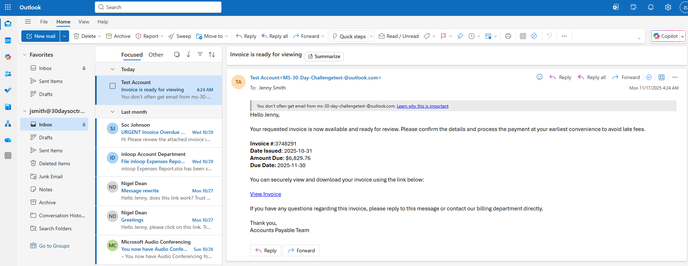
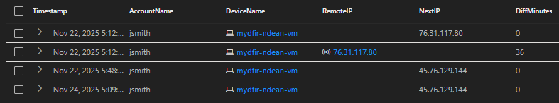

# Microsoft-30Day-SOC-Challenge
A 30-day journey through real-world SOC operations using Microsoft security stack. Includes KQL queries, incident response workflows, and reflections on building modern cloud detections.

## Overview
This repository documents my completion of the MyDFIR Microsoft 30-Day SOC Analyst Challenge, where I built and operated a cloud-based SOC environment using:
- Microsoft Sentinel
- Microsoft Defender XDR
- Microsoft Defender for Endpoint
- Entra ID Protection
  
Over 30 days, I performed real investigations, wrote incident reports, ran hunting queries, tested attack simulations, and created dashboards—mirroring what Tier 1 & Tier 2 SOC analysts do in production environments.

# Table of Contents

| Day        | Topic                                      | Description                                            |
| ---------- | ------------------------------------------ | ------------------------------------------------------ |
| **Day 1**  | Lab Setup & Planning                       | Built the SOC lab & structured investigation workflow. |
| **Day 2**  | Virtual Machine Setup                      | Deployed Windows test VM for Defender onboarding.      |
| **Day 3**  | Sentinel Workspace Overview                | Connected logs & explored workspace features.          |
| **Day 4**  | KQL Queries                                | Learned core KQL for hunting & analytics.              |
| **Day 5**  | Dashboard Creation                         | Built custom dashboards for SOC visibility.            |
| **Day 6**  | Alert & Incident Creation                  | Triggered alerts and analyzed incidents.               |
| **Day 7**  | Incident Investigation Report              | First structured IR report.                            |
| **Day 8**  | Bookmarks & Manual Incidents               | Documented evidence for investigations.                |
| **Day 9**  | Project Documentation & Resource Index     | Created resource library + tools list.                 |
| **Day 10** | Device Inventory & Exposure Management     | MDE exposure analysis.                                 |
| **Day 11** | Defender for Office P2 Overview            | Safe Links, Safe Attachments, Anti-Phishing.           |
| **Day 12** | Safe Links Policy                          | Policy creation & testing.                             |
| **Day 13** | Anti-Phishing Policy                       | Policy creation & tuning practice.                     |
| **Day 14** | Explorer & Quarantine                      | Email investigation using Explorer.                    |
| **Day 15** | Phishing Simulation                        | Ran Office 365 phishing attack test.                   |
| **Day 16** | Suspicious Email Report — **Mini Project** | Full phishing IR report.                               |
| **Day 17** | Defender for Endpoint                      | Telemetry exploration.                                 |
| **Day 18** | MDE Dashboard Analysis                     | Endpoint health & threat visibility.                   |
| **Day 19** | Intune ASR Rules                           | Hardened Windows endpoint.                             |
| **Day 20** | Atomic Red Team Attack                     | Simulated endpoint compromise.                         |
| **Day 21** | Threat Hunting                             | Wrote structured hunting queries.                      |
| **Day 22** | Hypothesis Testing                         | Query-driven threat hunting.                           |
| **Day 23** | Endpoint Investigation — **Mini Project**  | Full endpoint compromise analysis.                     |
| **Day 24** | Entra ID Protection                        | Identity risk monitoring.                              |
| **Day 25** | Conditional Access (Foreign IP Test)       | Foreign-login simulation & policy validation.          |
| **Day 26** | Sign-in & Audit Log Review                 | Identity investigation fundamentals.                   |
| **Day 27** | Entra Logs → Sentinel                      | Data ingestion + log validation.                       |
| **Day 28** | Multi-Signal Simulation                    | Phishing + risky sign-in + MDE threat.                 |
| **Day 29** | Incident Investigation — **Mini Project**  | End-to-end cross-domain incident report.               |


# Mini-Projects Completed
Highlights of the 30 Day Challenge:

## Mini Project 1 — Suspicious Email Investigation
- Analyzed headers, URLs, attachments, and authentication patterns.
- Used Defender for Office, Explorer, and Threat Intelligence sources.

## Mini Project 2 — Endpoint Compromise Analysis
- Reviewed execution, persistence, and network signals.
- Wrote an end-to-end investigation report with MITRE mapping.

## Mini Project 3 — Conditional Access + Identity Attack
- Simulated foreign login attempt and validated policy enforcement.

## Mini Project 4 — Cross-Domain Incident Report
- Combined identity logs, endpoint telemetry, process events, and KQL queries.
- Built a WHO/WHAT/WHEN/WHERE/HOW report detailing attacker actions.


## Day 1 - Lab Setup and Planning

**Objective:**  
Create an Azure account, set up billing alerts, and define a resource naming convention.  
Plan out the lab structure and goals for the 30-Day Challenge.

**Tasks Completed:**  
- Created Microsoft Azure account and configured billing alert thresholds.  
- Defined resource naming convention (e.g., MyDFIR-Dean-Sentinel).  
- Outlined lab plan and estimated completion schedule.  

**Reflection:**  
Setting up the environment helped me understand Azure cost management and resource organization.  

## Day 2 - Virtual Machine Setup

**Objective:**  
Create a virtual machine in Azure or on-premises for use in the SOC lab.

**Tasks Completed:**  
- Deployed Windows 10 VM for endpoint simulation.  
- Configured network settings and baseline security policies.  
- Verified connectivity to Microsoft Sentinel workspace.  

**Reflection:**  
Learned how to spin up and secure virtual machines for monitoring and testing.  
  
## Day 3 - Sentinel Workspace Overview

**Objective:**  
Explore the Sentinel interface and familiarize with its tabs, features, and capabilities.

**Tasks Completed:**  
- Reviewed **Overview**, **Incidents**, **Logs**, **Hunting**, and **Workbooks** tabs.  
- Captured initial dashboard screenshot for future portfolio use.  

**Reflection:**  
Understanding Sentinel’s UI made it easier to navigate during later assignments.  
 
# Day 4 - KQL Queries

## Objective
Use KQL to query Microsoft Sentinel logs and identify authentication failures, event trends, and host activity patterns to strengthen detection and analysis capabilities.

---

## Tools & Concepts
- Microsoft Sentinel  
- Log Analytics Workspace  
- KQL (Kusto Query Language)  
- EventID 4625 (Failed Logon Events)  
- SOC Analysis & Detection

---

## Query 1 - Top Accounts with Failed Logons
```kql
SecurityEvent_CL
| where EventID_s == "4625"
| summarize FailedAttempts = count() by Account_s, AccountType_s
| top 10 by FailedAttempts desc
```
### Purpose:
Identify which accounts have the highest number of failed login attempts.
### Why It’s Important:
This helps detect brute-force or password-spraying attacks targeting user or admin accounts.


### Observation:
Administrator accounts had an unusually high number of failed attempts, indicating potential credential-stuffing activity.

## Query 2 - Most Common Event IDs (Frequency Analysis)
```
SecurityEvent_CL
| summarize RandomCount = count() by EventID_s
| sort by RandomCount desc
```
### Purpose:
Show which Event IDs are most common in the dataset.
### Why It’s Important:
Helps analysts understand which event types dominate the log flow, giving context to noise vs. signal.


### Observation:
Event ID 4625 (Failed Logons) appeared most frequently, confirming heavy authentication failure activity.


## Query 3 - Failed Logons by Computer and Account
```
SecurityEvent_CL
| where EventID_s == "4625"
| summarize FailedAttempts = count() by Computer, Account_s
| top 5 by FailedAttempts desc
```
### Purpose:
Correlate failed logon attempts with the computers where they occurred.
### Why It’s Important:
Reveals which systems are being targeted, supporting scoping and prioritization in investigations.


### Observation:
The SOC-FW-RDP host had the highest failed logons, suggesting external RDP brute-force attempts.

# Day 5 - Dashboard Creation

## Objective
Add three panels to Microsoft Sentinel dashboard using different visualization types: bar, line, and pie.

---

## Tools & Concepts
- Microsoft Sentinel Workbooks  
- KQL Queries for visual data  
- Visualization Types: Bar • Line • Pie  

---

## Panel 1 – Failed Logons by Account (Pie Chart)

**Objective:**  
Identify which user accounts are experiencing the most failed login attempts by visualizing their proportion of total failures.

**KQL Query:**
```kql
SecurityEvent_CL
| where EventID_s == "4625"
| summarize Count = count() by Account_s
| sort by Count
| take 5
```
### Purpose:
Breaks down the top 5 accounts with the highest number of failed logon events (Event ID 4625).
Visualizing the data as proportions highlighting accounts that contribute most to the failed login volume.
### Why It’s Important:
- Quickly identifies high-risk or frequently attacked accounts.
- Useful for validating whether brute-force activity targets specific privileged users.
- Provides an at-a-glance metric for SOC dashboards or executive summaries.


### Observation:
Administrator-level accounts dominated the failed login attempts (`\ADMINISTRATOR, \admin, \administrator`), suggesting targeted password-guessing activity on privileged users.
This insight guides better alert tuning and reinforces defenses for privileged account credentials.

## Panel 2 - Event ID Count (Column Chart)

**Objective:**  
Visualize the frequency of different Windows Event IDs in the dataset to identify which event types occur most often.

**KQL Query:**
```kql
SecurityEvent_CL
| summarize Total = count() by EventID_s
| sort by Total asc
| take 15
| render columnchart
```

### Purpose:
This column chart displays the top 15 Event IDs and their frequency counts from security logs.
By visualizing event frequency, analysts can quickly determine which activities dominate the environment, which helps separate common background noise from potential anomalies.
### Why It’s Important:
- Reveals the most frequent system events (normal baseline behavior).
- Highlights rare or infrequent Event IDs that might indicate suspicious activity.
- Helps prioritize which logs to focus on for deeper analysis.


### Observation:
Event ID 5058 occurred the most, significantly higher than others like 4624 and 4625.
Can be used to help establish a baseline for normal system activity.

## Panel 3 - Failed Logons Over Time (Line Chart)

**Objective:**  
Visualize the trend of failed logon attempts across accounts over a specific time window.

**KQL Query:**
```kql
SecurityEvent_CL
| extend EventTime = todatetime(replace_string(TimeCollected_UTC__s, ",", ""))
| where EventTime between (datetime(2021-04-16 00:00:00) .. datetime(2021-04-17 00:00:00))
| summarize FailedLogons = count() by bin(EventTime, 5m), Account_s
| order by EventTime asc
| render timechart
```
### Purpose:
This line chart tracks failed logon activity for each account in 5-minute intervals, helping analysts identify login bursts or anomalies across time.
### Why It’s Important:
- Reveals temporal patterns in brute-force or password-spray attempts.
- Helps correlate spikes in failed logons with specific attack windows.
- Enables proactive tuning of analytic rules and rate-based detections.
  

### Observation:
The `\ADMINISTRATOR` account maintained consistently high failure counts, peaking around 03:35 AM, indicating repeated login attempts within a short period.
Other accounts like `\admin` and `\administrator` show similar spikes, supporting a likely password-spray pattern across multiple privileged users.

# Day 6 - Alert and Incident Creation

## Objective
Create a custom analytic rule in Microsoft Sentinel using KQL to detect multiple failed logon attempts and generate an alert when thresholds are exceeded.

---

## Tools & Concepts
- Microsoft Sentinel  
- Microsoft Defender XDR  
- KQL (Kusto Query Language)  
- Analytic Rules & Incidents  
- Detection Engineering  

---

## Detection Query
```kql
SecurityEvent_CL 
| where EventID_s == "4625" 
| summarize FailedLogons = count() by Account_s
| where FailedLogons >= 1000
```
### Purpose:
Detect accounts exceeding 1,000 failed logon attempts. A common indicator of brute-force or password-spray activity. 
### Why It’s Important:
- Failed logons are early indicators of brute-force or password-spray attacks.
- Detecting abnormal volumes helps identify unauthorized access attempts.
- Custom analytic rules in Sentinel enable proactive detection and alerting.
- Supports MITRE ATT&CK technique TA0006 – Credential Access.

### Observation:
The rule triggered several MyDFIR-ndean-FailedLogonAlert incidents (9–15 attempts), confirming the query worked.
In a real SOC, this would prompt a check for repeated failures or password-spray activity.

# Day 7 - Incident Investigation Report

## Objective
Investigate an alert generated from the “Multiple Failed Logons Detection” rule in Microsoft Sentinel to determine scope, impact, and recommended actions.

---

## Tools & Concepts
- Microsoft Sentinel  
- KQL (Query Language)  
- MITRE ATT&CK T1110 (Brute Force)  
- Incident Handling Lifecycle  

---

## Findings
**Alert Name:** Multiple Failed Logons Detected  
**Severity:** High  
**Event ID:** 4625 (Failed Logon)  
**Time Range:** 2024-04-16 08:34 UTC – 09:33 UTC  
**Affected Hosts:** `SHIR-Hive`, `SHIR-SAP`, `SOC-FW-RDP`  
**Targeted Accounts:** `\ADMINISTRATOR`, `\admin`, `\administrator`  

---

## Investigation Summary
On 2024-04-16 08:34 UTC, multiple failed logon attempts were detected from several hosts targeting privileged accounts.  
The activity pattern suggested a **brute-force or password-spray attack**.  
No successful logons (Event ID 4624) were observed, indicating the attempts were unsuccessful.  
The activity likely used automated credential guessing via RDP or network authentication.

---

##  WHO
**Hosts:** `SHIR-Hive`, `SHIR-SAP`, `SOC-FW-RDP`  
**Accounts Targeted:** Administrator accounts across multiple hosts  


---

## WHAT
Failed attempts totaling **18,163** across the three hosts.

---

## WHEN
| Host | Time Range (UTC) |
|------|-------------------|
| SHIR-Hive | 2021-04-16 08:34 – 09:33 |
| SHIR-SAP | 2021-04-16 08:34 – 09:33 |
| SOC-FW-RDP | 2021-04-16 08:34 – 09:00 |


Limited data to confirm if activity continued beyond this window.

---

## WHERE
Activity originated from internal hosts `SHIR-Hive`, `SHIR-SAP`, and `SOC-FW-RDP`,  
suggesting an attack via RDP or Windows authentication services.

---

## WHY
Likely an automated attacker attempting to gain access to privileged accounts via brute-force or password spray.  
If these hosts are internet-facing or relay services, external actors may be involved.

---

## HOW
Automated tool or script iterating credentials against accounts over RDP / domain authentication.  
The hostname `SOC-FW-RDP` indicates a remote desktop front end likely used for testing or management.

---

## Supporting KQL Queries
```kql
// Failed logons by host
SecurityEvent_CL
| where EventID_s == "4625"
| summarize FailedAttempts = count() by Computer, Account_s
| top 10 by FailedAttempts desc
```

# Day 8 - Bookmark & Manual Incident

## Objective
Use Microsoft Sentinel to identify a notable pattern in Office 365 activity logs, bookmark the finding, and create a manual incident for further investigation.

---

## Tools & Concepts
- Microsoft Sentinel  
- OfficeActivity_CL table  
- KQL (Kusto Query Language)  
- Bookmarks & Manual Incidents  
- SOC Investigation Workflow  

---

## KQL Query
```kql
OfficeActivity_CL
| where Operation_s == "FileAccessed"
```
### Purpose:
Retrieve Office 365 file-access events to review for unusual activity such as access from new or unexpected IP addresses.
### Why It's Important:
Manual incidents help analysts capture context that automated detections may miss.
They demonstrate the ability to:
- Recognize suspicious behavior during proactive log review
- Escalate findings with supporting evidence
- Maintain clear documentation for peer validation

### Observation:
- The FileAccessed query showed activity from an unusual IP address.
- A bookmark was created for further review.
- May indicate suspicious or unauthorized access requiring investigation.

## MITRE ATT&CK Mapping
| Tactic            | Technique      | ID    |
| ----------------- | -------------- | ----- |
| Credential Access | Brute Force    | T1110 |
| Execution         | User Execution | T1204 |
| Defense Evasion   | Valid Accounts | T1078 |

## Recommendations
1. Implement and enforce account lockout policy for failed login thresholds.
2. Require Multi-Factor Authentication (MFA) for all privileged and remote accounts.
3. Audit RDP and administrative access to validate legitimate use.
4. Monitor for continued failed logon spikes and create dynamic alerts for Event ID 4625.
5. Restrict RDP exposure to internal networks only.

## 🪞 Reflection
This incident reinforced my understanding of how failed logon patterns can signal early-stage brute-force attacks.
Correlating Event IDs 4625 and 4624 helped confirm that no compromise occurred, while visualizing the data clarified attack timing and scope.
Going forward, I plan to develop automated Sentinel rules and playbooks to detect similar behavior proactively.


# Day 29 - Microsoft Defender XDR Incident Report

**Alert:** Hands-on Keyboard Attack via Possible Credential Misuse

**Serverity:** High


*Figure 1 - Microsoft Defender XDR incident overview showing high-severity alerts.*


## 1. Findings

### Title:  
Hands-on Keyboard Activity via Possible Credential Misuse

### Timeframes:
- First Malicious Activity: 2025-11-22 05:55 UTC
- Second Activity Wave: 2025-11-24 05:12–05:29 UTC

### Host
- mydfir-ndean-vm

### IOC Domain
- None observed before compromise

### IOC IPs
- 45.76.129.144 (foreign IP, London UK — impossible travel indicator)
- 76.31.117.80 (expected region, initial login source)

### Possible Malware / Tooling
- HackTool:Win32/Mimikatz
- HackTool:Win32/Mimikatz!pz
- HackTool:Win32/Mimikatz!MSR
- Trojan:PowerShell/Mimikatz.A
- Meterpreter
- PowerSploit
- AdFind
- BadCastle


 
*Figure 2 - Initial Mimikatz credential-theft detection on the compromised host.*

## 2. Investigation Summary

Between November 22 and November 24, 2025, Microsoft Defender XDR recorded a sequence of suspicious and malicious activities on host `mydfir-ndean-vm` associated with the user account `AzureAD\JennySmith (jsmith)`. Activity appears to have begun following remote logons originating from two geographically incompatible locations, potentially indicating credential misuse.

During the first activity wave, multiple Mimikatz variants and post-exploitation commands were executed or attempted. Discovery actions followed, including AD enumeration and PowerShell-based exploration. A second wave on November 24 included additional credential-theft attempts and suspicious tooling activity.

Defender appears to have successfully blocked or remediated all malicious actions. No evidence was identified showing successful lateral movement, credential theft, data access, or data exfiltration. Activity remained contained to mydfir-ndean-vm.

## 3. Cross-Domain Correlation (Email → Identity → Endpoint)

### 3.1 Email – Phishing Attempt (Initial Vector)


*Figure 3 - Phishing email providing the likely initial credential exposure point.*

- User received a phishing email containing a suspicious link
- Defender for Office logged the message and performed Safe Links scanning
- No confirmed click event, but email provides a credible source for credential exposure

Email → Identity Connection:
Phishing email precedes risky sign-in — indicating possible credential compromise.

### 3.2 Identity – Risky Sign-in / Impossible Travel

Risky Sign-In Query - Identify Risky Sign-in From a Foreign IP

```kql
// Risky Sign-In (Foreign Location / Impossible Travel)
DeviceLogonEvents
| where DeviceName == "mydfir-ndean-vm"
| where LogonType contains "RemoteInteractive" or LogonType contains "Network"
| where RemoteIP != "76.31.117.80"   // expected region IP
| project Timestamp, AccountName, LogonType, RemoteIP, ActionType
| order by Timestamp asc
```

What this query does:
- Filters to interactive or network logons on the victim VM
- Excludes your known “home region” IP to surface foreign activity
- Shows only successful RemoteInteractive logons from unexpected IPs
- Helps confirm credential misuse from 45.76.129.144


*Figure 4.1 - Successful foreign RemoteInteractive logons from 45.76.129.144 indicating credential misuse and potential impossible travel.*

Impossible Travel Query - Detect “Impossible Travel” Between Logons

```kql
//Impossible Travel
DeviceLogonEvents
| where DeviceName == "mydfir-ndean-vm"
| where AccountName == "jsmith"
| order by Timestamp asc
| extend NextTime = next(Timestamp), NextIP = next(RemoteIP)
| extend DiffMinutes = datetime_diff("minute", NextTime, Timestamp)
| where RemoteIP != NextIP and DiffMinutes <= 60
| project Timestamp, AccountName, DeviceName, RemoteIP, NextIP, DiffMinutes
```

What this query does:
- Sorts all sign-ins for the compromised account
- Compares each login with the next login (timestamp + IP)
- Calculates time between the two logons
- Flags cases where:
	- IP changes location, AND
	- The time between logons is too short to travel physically
- This helps strengthen the case of impossible travel and strongly supports credential compromise



*Figure 4.2 — Impossible Travel event showing rapid IP change from expected region (76.31.117.80) to foreign IP (45.76.129.144).

Why this matters
- Two sign-ins happen back-to-back from geographically incompatible IPs
- Entra ID flags the event as Impossible Travel
- The login succeeds, which means credentials were valid
- This ties directly back to the phishing email earlier in the chain

Identity → Endpoint Connection:
Minutes after the foreign login, hands-on-keyboard activity attacker appear on the endpoint, signaling a progression from identity compromise to endpoint compromise.

### 3.3 Endpoint – Hands-on Keyboard Attack Activity

```kql
//Attacker Timeline
union isfuzzy=true
    DeviceProcessEvents,
    DeviceEvents,
    DeviceLogonEvents
| where DeviceName == "mydfir-ndean-vm"
| where AccountName in ("jsmith", "jennysmith")
| where ProcessCommandLine has_any ("mimikatz", "sekurlsa", "lsass", "adfind", "badcastle", "powershell", "cmd")
       or ActionType in ("NamedPipeEvent", "DpapiAccessed", "InboundConnectionAccept", "ProcessCreated")
       or LogonType contains "RemoteInteractive"
| project Timestamp, AccountName, ActionType, FileName, ProcessCommandLine, RemoteIP
| order by Timestamp asc
```

### Explanation of Attacker Timeline Query (click to expand)
<blockquote>

- Merges **DeviceProcessEvents**, **DeviceEvents**, and **DeviceLogonEvents** into a single timeline using `union isfuzzy=true`.
- Filters activity to **mydfir-ndean-vm** and the compromised accounts **jsmith / jennysmith**.
- Detects known attacker tooling such as **Mimikatz, AdFind, BadCastle, and PowerShell**.
- Captures high-signal behaviors including **NamedPipeEvent**, **DpapiAccessed**, **InboundConnectionAccept**, **ProcessCreated**, and **RemoteInteractive** logons.
- Produces a **unified, chronological view** of the attacker’s hands-on-keyboard activity following the foreign sign-in.

</blockquote>


*Figure 5 — Suspicious remote session showing hands-on-keyboard activity moments after the foreign login.*

Minutes after risky sign-in, endpoint logs show post-authentication activity executions 

- Mimikatz variants
- PowerShell used interactively 
- Discovery Tools (AdFind / BadCastle enumeration)
- RDP lateral movement attempt blocked

Attacker transitioned from identity compromise to full endpoint exploitation attempt.


## 4. WHO / WHAT / WHEN / WHERE / WHY / HOW

### WHO
Activity tied to the compromised account AzureAD\JennySmith (jsmith / jennysmith).


*Figure 6 — RemoteInteractive logons tied to AzureAD\JennySmith showing credential misuse.*

- Shows RemoteInteractive logons using jsmith and jennysmith
- Includes both expected region logons from 76.31.117.80 and foreign logons from 45.76.129.144
- Confirms the suspicious foreign IP successfully authenticated
- Indicates the account was used by an attacker to remotely access the host
  
### WHAT

Evidence shows a sequence of remote authentication, process execution, and post-exploitation activity on mydfir-ndean-vm.


*Figure 5 — Suspicious remote session showing hands-on-keyboard activity moments after the foreign login.*


- Shows successful logons for jsmith followed by process activity under jennysmith
- Connects the remote login to the processes created immediately after authentication
- Highlights an attacker-controlled session where multiple processes were spawned in sequence
- Demonstrates what actions the attacker performed after gaining access (post-exploitation behavior)


*Figure 4 — Impossible Travel alert confirming successful foreign authentication.*


*Figure 7 — Correlated processes executed under the compromised account during the attacker session.*

This query:
- Looks at all processes executed on mydfir-ndean-vm
- Filters only the ones run by the specific compromised account (using Account SID)
- Filters further to show only processes run during a session from the malicious foreign IP 45.76.129.144
- Shows what commands were executed and which parent processes launched them
- Orders all events in a timeline, showing the attacker’s hands-on-keyboard activity

### WHEN

Identifies when the attacker activity occurred and how events progressed over time.
Key Timestamps:
- Foreign login (impossible travel): 11:48 UTC
- First Mimikatz detection: 12:55 UTC
- Blocked RDP lateral movement: 13:10 UTC
- Second activity wave: Nov 24, 11:12–11:29 UTC
- No malicious activity after 11:48 UTC, Nov 24

Put Screenshot HERE: 

*Figure 7 — Correlated processes executed under the compromised account during the attacker session.*

- Timeline shows activity beginning shortly after the foreign RemoteInteractive logon
- Attacker actions appear in multiple event sources (DeviceProcessEvents, DeviceEvents, DeviceLogonEvents, DeviceNetworkEvents)
- Events labeled "Likely attacker" confirm correlation across logons, processes, named pipes, and DPAPI access
- Process execution under jennysmith occurs minutes after the initial compromise, showing rapid post-logon activity

The sequence reflects a continuous attacker session, with actions increasing in frequency over the identified timeframe

### WHERE

- All activity occurred on mydfir-ndean-vm
- No evidence of spread to other devices
- Remote access originated from external IPs

### WHY (Theory-based)
- Activity may indicate the use of compromised credentials
- Pattern aligns with reconnaissance, credential-theft attempts, and early-stage intrusion behavior

### HOW (Theory-based)


*Figure 8 — Defender blocking attempted RDP lateral movement from the compromised host.*

- Remote authentication using the AzureAD\JennySmith account
- Subsequent execution of PowerShell commands, Mimikatz, and post-exploitation frameworks
- Discovery and reconnaissance activity followed
- Defender remediated or blocked malicious actions, preventing expansion

##5. Impact Assessment

Telemetry indicates that the activity was contained to one endpoint. Several credential-theft and post-exploitation tools executed briefly before remediation, creating a possible, although unconfirmed, risk of limited in-memory credential exposure. No evidence was found indicating lateral movement, persistence, privilege escalation, data access, or exfiltration. All malicious actions appear to have been blocked, terminated, or remediated.

## 6. Recommendations

### Identity Actions
- Reset passwords for involved accounts
- Require MFA re-registration
- Review conditional access to restrict foreign sign-in attempts

### Endpoint Actions
- Consider isolating or re-imaging mydfir-ndean-vm
- Review RDP exposure and harden remote access
- Validate firewall and remote access policies

### Detection and Hardening
- Enable ASR rules (especially LSASS protection)
- Confirm ScriptBlock Logging and audit policies
- Validate Defender Cloud-Delivered Protection

📸 Insert Screenshot:

*Figure 9 — ASR and behavioral detections contributing to automatic remediation.*

##7. Investigation Timeline
November 22, 2025
05:12 UTC   Remote logon from 76.31.117.80
05:48 UTC   Foreign logon from 45.76.129.144 (impossible travel)
05:55 UTC   First Mimikatz detection
06:03–06:04 Additional Mimikatz execution attempts
06:41 UTC   Hands-on-keyboard activity
07:10 UTC   RDP lateral movement attempt blocked

November 24, 2025
05:12 UTC   Suspicious PowerShell activity begins
05:16–05:18 Post-exploitation frameworks observed
05:17–05:28 Discovery tools executed: AdFind, BadCastle
05:18–05:28 Multiple Mimikatz variants detected
05:27 UTC   Ransomware-linked behavior alert
05:28–05:29 Final PowerShell activity
05:48 UTC   No further malicious activity recorded

📸 Insert Screenshot:

*Figure 10 — Full alert timeline reconstructing attacker behavior across two days.*


##8. Key KQL Queries Used

List all alerts on the host

AlertInfo
| where DeviceName == "mydfir-ndean-vm"
| order by TimeGenerated asc


*Figure 11 — KQL query output validating alert chronology and process execution trail.*

Confirm Mimikatz was the first high-severity alert
AlertInfo
| where DeviceName == "mydfir-ndean-vm"
| where Severity in ("High", "Medium")
| where TimeGenerated < datetime(2025-11-22 05:55:18)

*Figure 11 — KQL query output validating alert chronology and process execution trail.*

Impossible-travel logon verification
DeviceLogonEvents
| where DeviceName == "mydfir-ndean-vm"
| project Timestamp, AccountName, RemoteIP, LogonType

*Figure 11 — KQL query output validating alert chronology and process execution trail.*

##9. Conclusion

Based on the available data, the activity observed on mydfir-ndean-vm appears confined to early-stage intrusion behaviors involving credential misuse, reconnaissance, and attempted execution of credential-theft tools. All malicious tooling appears to have been blocked or remediated by Microsoft Defender, and no evidence was identified showing further spread, persistence, or data compromise.
