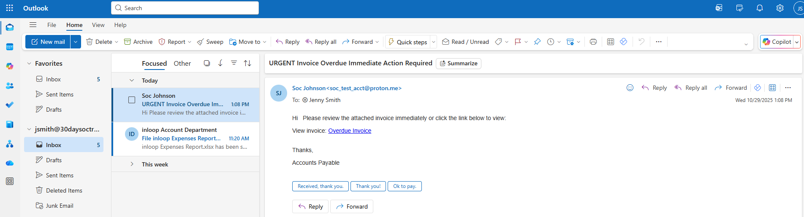
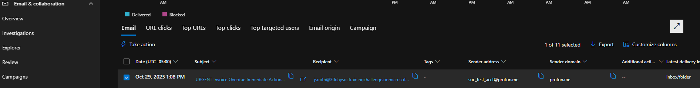
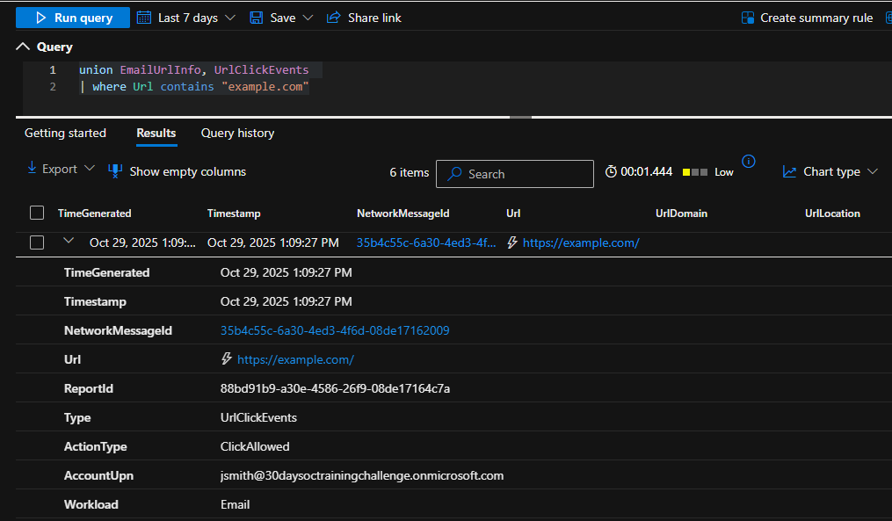
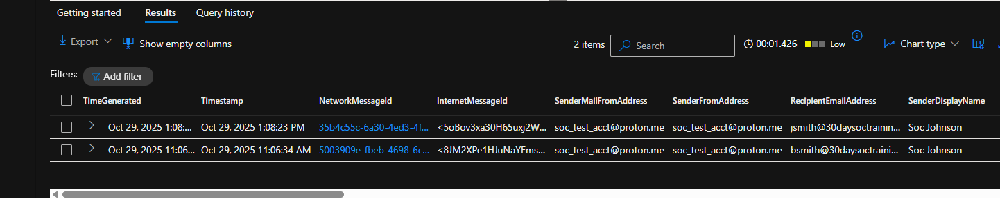

# Mini Project 1 – Suspicious Email Investigation

## Objective

Simulate a suspicious email delivery and demonstrate how a SOC analyst investigates email metadata, sender behavior, and user interaction using Microsoft Defender for Office and Advanced Hunting.

## Tools Used

- Microsoft Defender for Office 365 - Explorer
- Microsoft Defender XDR - Advanced Hunting
- Outlook
- KQL - EmailEvents, EmailUrlInfo, UrlClickEvents

## Incident Type

Phishing – Invoice Lure / Social Engineering

This activity aligns with common credential-harvesting phishing techniques targeting end users through urgency-based invoice themes.

## Investigation Walkthrough

## Step 1: Suspicious Email Received in User Inbox

A suspicious invoice-themed email was received by \*\*Jenny Smith\*\*. The message uses urgency and a payment/invoice lure to push the user to click a link (“Overdue Invoice”), which is a common phishing tactic.

**Initial red flags observed**
- Urgent subject line: **“URGENT Invoice Overdue Immediate Action Required”**
- External sender: \*\*Soc Johnson <soc\_test\_acct@proton.me>\*\*
- Social engineering language encouraging immediate action
- Embedded hyperlink: \*\*“Overdue Invoice”\*\*
- Generic finance wording (“Accounts Payable”) with no company context

This email exhibits classic phishing indicators intended to pressure the recipient into clicking quickly.


*Outlook inbox showing suspicious invoice-themed email delivered to the user.*

---
## Step 2: Email Metadata Review in Defender Explorer

After identifying the suspicious email in the user’s inbox, I pivoted to **Microsoft Defender → Email & Collaboration → Explorer** to validate delivery details and assess risk.

**Key Findings**
- **Email was successfully delivered** to the inbox (not blocked or quarantined)
- **Recipient:** jsmith@30daysoctrainingchallenge.onmicrosoft.com
- **Sender address:** soc_test_acct@proton.me
- **Sender domain:** proton.me (external email provider)
- **Delivery location:** Inbox
- **No tags or prior classification** applied by Defender at delivery time

These findings confirm the phishing email bypassed initial filtering controls and reached the end user, increasing the risk of credential exposure or follow-on compromise if the message was interacted with.


*Defender for Office Explorer showing delivery status and sender metadata for the suspicious email.*

## Step 3: URL Click Analysis via Advanced Hunting

After confirming the phishing email was delivered to the user’s inbox, I pivoted to Advanced Hunting to determine whether the embedded link was interacted with and to assess potential user exposure.

I queried EmailUrlInfo and UrlClickEvents to identify clicks associated with the suspicious domain.

### Query Used

```kql

union EmailUrlInfo, UrlClickEvents

| where Url contains "example.com"

```

#### Key Findings
- Multiple URL click events were recorded for the embedded link
- ActionType: ClickAllowed
- User account: jsmith@30daysoctrainingchallenge.onmicrosoft.com
- URL: https://example.com
- Workload: Email
- Source IP: Expected user Region

This helps confirm the user interacted with the phishing link, increasing the risk of credential harvesting or follow-on payload delivery. While the destination domain in this simulation was benign, the behavior mirrors real-world phishing scenarios where malicious infrastructure would be present.


*Advanced Hunting results showing allowed URL click events tied to the phishing email.*

---

## Step 4: Environment Scoping – Sender Infrastructure Analysis

After confirming user exposure, the next step was to determine whether this phishing activity was isolated or part of a broader campaign. To scope the impact across the environment, I searched for additional emails originating from the same sender infrastructure.

### Query Used

```kql

EmailEvents

| where SenderIPv4 contains "185.70.43.166"

```

#### Key Findings
- The same external sender IP delivered emails to multiple recipients
- Targeted users:
	- jsmith
	- bsmith
- Sender address remained consistent: soc_test_acct@proton.me
- Confirms the activity was not limited to a single user
- Indicates phishing behavior consistent with a small-scale campaign

This scoping step determines how widespread the activity is and informs containment actions like bulk remediation, blocking the sender, and alerting impacted users.


*Advanced Hunting results showing multiple recipients targeted from the same sender IP.*

---

## Step 5: Impact Assessment and Outcome

### Assessment by User

**jsmith**
- Email delivered to inbox
- User **clicked the embedded link**
- Destination domain was benign (simulation)
- No malware execution observed
- No Defender for Endpoint alerts triggered

**bsmith**
- Email delivered to inbox
- **No URL click activity observed**
- No indicators of user interaction or compromise

### Overall Outcome
- No persistence mechanisms identified
- No lateral movement detected
- No endpoint or identity compromise observed
- Activity was contained at the **email layer**

Based on these findings, no incident escalation was required beyond email remediation, sender blocking, and continued monitoring.

## Recommendations
1. Strengthen phishing detection rules for invoice-themed emails.
2. Increase user awareness training around urgency-based messages.
3. Monitor repeated URL clicks from similar sender domains.
4. Consider tightening policies for free email provider domains.
5. Enable automated investigation for similar email alerts.

## Conclusion
This walkthrough demonstrates a SOC email investigation from inbox triage through Advanced Hunting validation. The incident was contained at the email layer, and no further compromise was observed, highlighting the value of Defender visibility into user interaction and click telemetry.