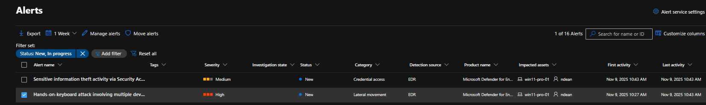
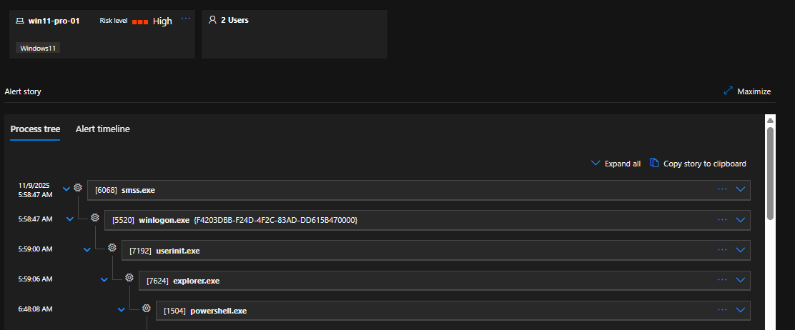
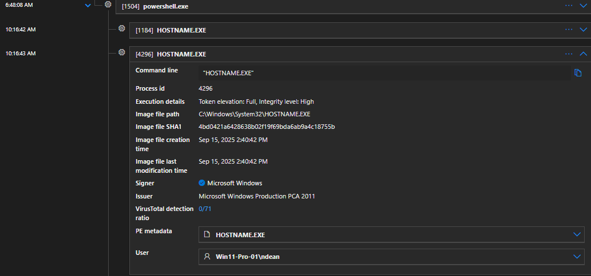
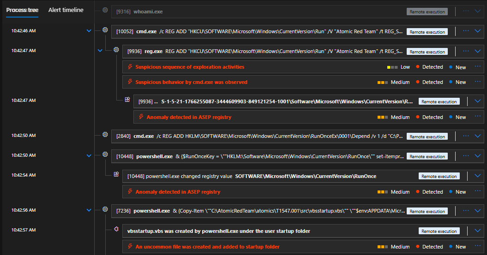
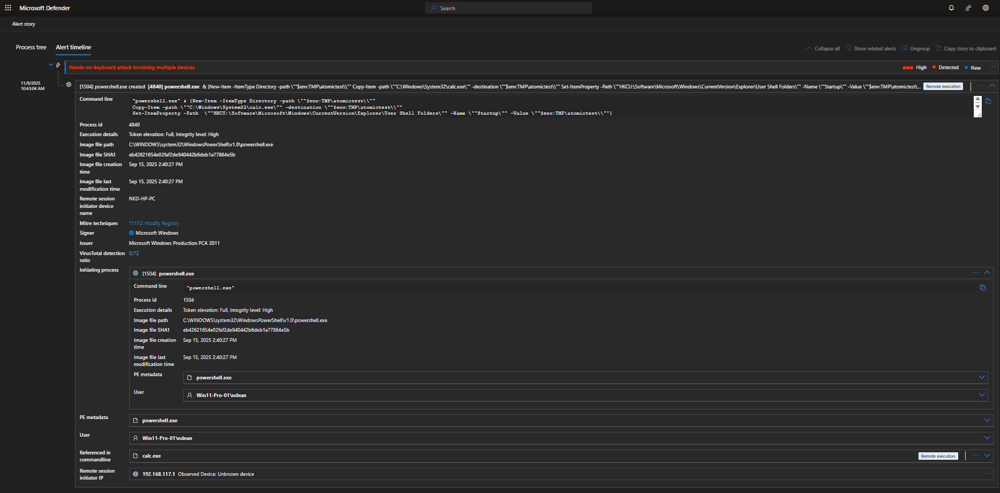

# Mini Project 2 – Endpoint Compromise Analysis

## Technical Walkthrough

---

## Step 1: Alert Triage and Initial Context

Microsoft Defender for Endpoint generated a **high-severity alert** indicating a *hands-on-keyboard attack involving multiple devices*. This alert suggested **interactive attacker behavior** rather than automated malware execution.

**Key initial details reviewed**
- **Alert severity:** High  
- **Category:** Lateral Movement  
- **Impacted device:** win11-pro-01  
- **Detection source:** EDR  
- **Investigation state:** New  

This warrented immediate **process tree** and **timeline analysis**.

*High-severity Microsoft Defender for Endpoint alert indicating hands-on-keyboard attacker activity.*
---

## Step 2: Process Tree Analysis

The process tree was reviewed to understand execution flow and identify suspicious parent-child relationships.

**Observed execution chain**
- `smss.exe` → `winlogon.exe` → `userinit.exe` → `explorer.exe`
- `explorer.exe` spawned `powershell.exe`
- PowerShell executed multiple child processes and created additional files

The presence of **interactive PowerShell execution originating from a logged-in user session** is consistent with post-compromise, hands-on-keyboard activity rather than benign automation.

*Process tree showing explorer.exe spawning PowerShell, consistent with interactive attacker behavior.*
---

## Step 3: Suspicious Tooling and Post-Exploitation Behavior

Further inspection revealed PowerShell creating files associated with known **post-exploitation frameworks**, including:

- Meterpreter-related tooling  
- PowerSploit components  
- Custom executables dropped during execution  

These tools are commonly used after initial access for **discovery**, **credential access**, and **lateral movement preparation**.

*PowerShell creating files associated with Meterpreter and PowerSploit post-exploitation tooling.*
---

## Step 4: Discovery and Command-Line Activity

### 4.1 Discovery Commands

The attacker executed discovery commands to gather system and identity context, including:

- `hostname.exe`
- `whoami.exe`

These commands are typical of an attacker validating **system access** and **privilege level** after compromise.

*Execution of discovery commands (hostname, whoami) used to validate system and user context.*
---

### 4.2 Command-Line Behavior

Command-line inspection revealed:

- Registry modification commands
- Use of `cmd.exe` and `powershell.exe` for system configuration changes
- Evidence of deliberate, hands-on interaction rather than scripted malware

This behavior further reinforced the assessment of **manual attacker control**.

*Command-line execution showing registry modification and system configuration changes.*

---

## Step 5: Persistence Attempt Detection

Defender detected multiple attempts to establish persistence, including:

- Registry **Run** and **RunOnce** key modifications
- Creation of a startup script (`vbsstartup.vbs`) in the user startup folder

These actions align with **MITRE ATT&CK persistence techniques** and indicate intent to maintain access across reboots.

*Persistence mechanisms detected via registry Run/RunOnce keys and startup folder abuse.*

---

## Step 6: Timeline Correlation and Alert Confidence

The alert timeline was reviewed to correlate activity chronologically and validate alert confidence.

**Key observations**
- Events occurred in a tight, sequential window
- Discovery → tooling → persistence followed a logical attacker workflow
- Multiple Defender detections reinforced alert validity
- Activity matched hands-on-keyboard tradecraft, not false positives

This correlation significantly increased confidence that the alert represented **true malicious behavior**.

*Chronological correlation of discovery, execution, and persistence activity confirming malicious intent.*
---

## Outcome and Assessment

Based on the investigation:

- Activity was confirmed as **malicious hands-on-keyboard behavior**
- No evidence of successful lateral movement beyond the host
- Persistence attempts were detected before completion
- No credential dumping or domain-wide impact observed at time of analysis

The incident was **contained at the endpoint level**, with no further spread detected.

---

## Analyst Notes

This investigation demonstrates:
- The value of **process tree analysis** for detecting interactive attacks
- How Microsoft Defender correlates low-level events into **high-confidence alerts**
- The importance of validating alerts through **timeline correlation**, not relying on single indicators

