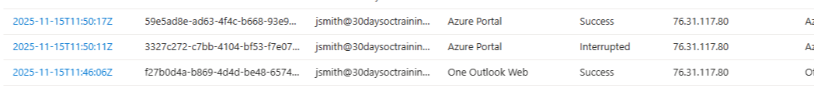
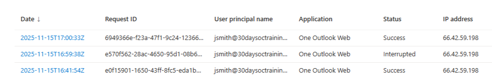
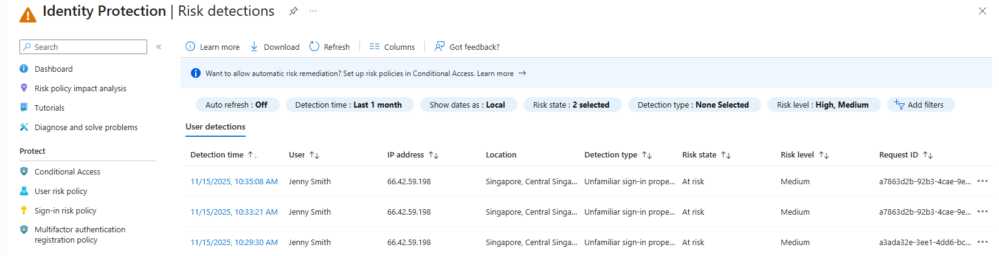
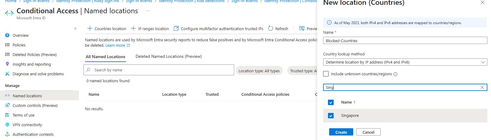
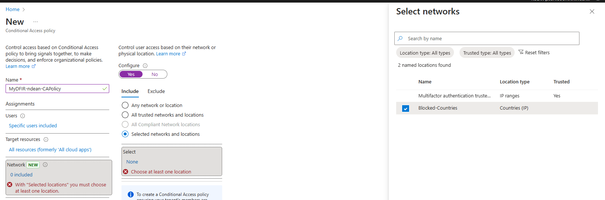

# Mini Project 3 – Conditional Access & Identity Attack Simulation

## Technical Walkthrough

---

## Step 1: Baseline Sign-In Activity Review

Sign-in logs were first reviewed to establish normal authentication behavior for the tenant prior to simulating attacker activity. This included validating known users, applications, and expected IP locations.

*Baseline sign-in activity showing successful authentications from expected locations with no Conditional Access enforcement applied.*

---

## Step 2: Foreign Sign-In Attempt Identified

Within the same sign-in log dataset, a successful authentication from an unexpected foreign IP address was identified for user `jsmith`. The IP address originated from Singapore, a region outside of normal business operations.

*Successful sign-in from foreign IP `66.42.59.198` prior to Conditional Access enforcement.*

---

## Step 3: Identity Risk Detection Triggered

Following the foreign sign-in, Microsoft Entra ID Identity Protection generated a risk detection indicating an **unfamiliar sign-in property**. This elevated the user’s identity risk level and confirmed anomalous authentication behavior.

*Identity Protection flagged the sign-in as risky due to unfamiliar location and properties.*

---

## Step 4: Conditional Access Policy Configuration

### Step 4.1: Named Location Creation

To enforce geographic restrictions, a Named Location was created representing countries the organization does not conduct business with. Singapore was added as a blocked country.

*Creation of a Named Location defining blocked countries based on IP geolocation.*

---

### Step 4.2: Conditional Access Policy Enforcement

A Conditional Access policy was created and scoped to the affected user. The policy targeted all cloud applications and enforced a **block access** action when sign-ins originated from the defined blocked location.

*Conditional Access policy configured to block access from non-business countries.*

---

## Step 5: Policy Validation and Enforcement Outcome

After the policy was enabled, a subsequent sign-in attempt from the same foreign IP was blocked. The user received an access denial message indicating the sign-in did not meet organizational security requirements.

*Foreign sign-in attempt successfully blocked by Conditional Access policy.*

---

## Step 6: Correlation and Analyst Confidence

Correlation across sign-in logs, Identity Protection alerts, and Conditional Access enforcement confirmed the effectiveness of identity-layer security controls. The threat was mitigated before any endpoint interaction occurred.

*Chronological correlation of sign-in activity, risk detection, and policy enforcement.*

---

## Outcome and Assessment

- Foreign sign-in activity was detected and flagged as risky
- Conditional Access successfully blocked access from non-business regions
- No endpoint compromise or lateral movement occurred
- Identity-based controls prevented escalation at the authentication layer

---

## Analyst Notes

This project demonstrates:

- How identity telemetry can surface threats before endpoint compromise
- The importance of geographic Conditional Access controls
- Effective use of Identity Protection and sign-in logs for early threat prevention
- Defense-in-depth beginning at the identity layer
