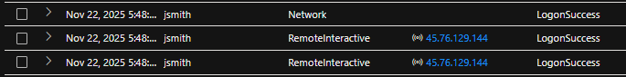
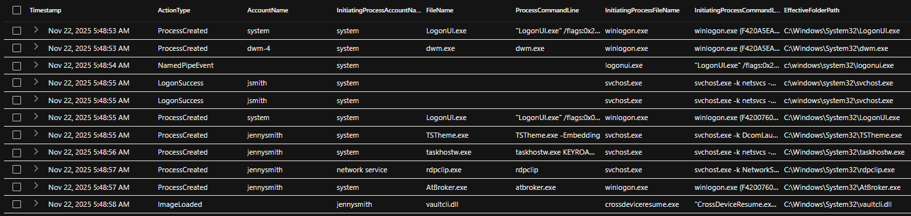

# Mini Project 4 – Hands-on Keyboard Attack via Credential Misuse


> Cross-domain incident investigation covering identity compromise, phishing, endpoint activity, and KQL-based hunting.


# Day 29 - Microsoft Defender XDR Incident Report

**Alert:** Hands-on Keyboard Attack via Possible Credential Misuse

**Serverity:** High


*Figure 1 - Microsoft Defender XDR incident overview showing high-severity alerts.*


## 1. Findings

### Title:  
Hands-on Keyboard Activity via Possible Credential Misuse

### Timeframes:
- First Malicious Activity: 2025-11-22 05:55 UTC
- Second Activity Wave: 2025-11-24 05:12–05:29 UTC

### Host
- mydfir-ndean-vm

### IOC Domain
- None observed before compromise

### IOC IPs
- 45.76.129.144 (foreign IP, London UK — impossible travel indicator)
- 76.31.117.80 (expected region, initial login source)

### Possible Malware / Tooling
- HackTool:Win32/Mimikatz
- HackTool:Win32/Mimikatz!pz
- HackTool:Win32/Mimikatz!MSR
- Trojan:PowerShell/Mimikatz.A
- SOAPHound
- AdFind
- BadPotato


 
*Figure 2 - Initial Mimikatz credential-theft detection on the compromised host.*

## 2. Investigation Summary

Between November 22, 2025 at 11:55 UTC and November 24, 2025 at 11:29 UTC, Microsoft Defender XDR observed malicious activity on mydfir-ndean-vm tied to the account AzureAD\JennySmith (jsmith). The incident began immediately after successful RemoteInteractive logins from two geographically inconsistent IP addresses, indicating likely credential misuse.

The first wave (starting Nov 22, 11:55 UTC) involved Mimikatz execution, interactive PowerShell activity, and initial domain discovery. The second wave (from Nov 24, 11:12–11:29 UTC) included continued credential-theft attempts, expanded AD reconnaissance using AdFind and SOAPHound, and a blocked privilege-escalation attempt with BadPotato.

Defender blocked or remediated all malicious activity. No successful privilege escalation, lateral movement, or data exfiltration occurred, and activity remained contained to mydfir-ndean-vm.

## 3. Cross-Domain Correlation (Email → Identity → Endpoint)

### 3.1 Email – Phishing Attempt (Initial Vector)


*Figure 3 - Phishing email providing the likely initial credential exposure point.*

- User received a phishing email containing a suspicious link
- Defender for Office logged the message and performed Safe Links scanning
- No confirmed click event, but email provides a credible source for credential exposure

#### Email → Identity Connection:
Phishing email precedes risky sign-in — indicating possible credential compromise.

### 3.2 Identity – Risky Sign-in / Impossible Travel

#### Risky Sign-In Query - Identify Risky Sign-in From a Foreign IP

```kql
// Risky Sign-In (Foreign Location / Impossible Travel)
DeviceLogonEvents
| where DeviceName == "mydfir-ndean-vm"
| where LogonType contains "RemoteInteractive" or LogonType contains "Network"
| where RemoteIP != "76.31.117.80"   // expected region IP
| project Timestamp, AccountName, LogonType, RemoteIP, ActionType
| order by Timestamp asc
```

##### What this query does:

- Filters to interactive or network logons on the victim VM
- Excludes your known “home region” IP to surface foreign activity
- Shows only successful RemoteInteractive logons from unexpected IPs
- Helps confirm credential misuse from 45.76.129.144




*Figure 4.1 - Successful foreign RemoteInteractive logons from 45.76.129.144 indicating credential misuse and potential impossible travel.*

#### Impossible Travel Query - Detect “Impossible Travel” Between Logons

```kql
//Impossible Travel
DeviceLogonEvents
| where DeviceName == "mydfir-ndean-vm"
| where AccountName == "jsmith"
| order by Timestamp asc
| extend NextTime = next(Timestamp), NextIP = next(RemoteIP)
| extend DiffMinutes = datetime_diff("minute", NextTime, Timestamp)
| where RemoteIP != NextIP and DiffMinutes <= 60
| project Timestamp, AccountName, DeviceName, RemoteIP, NextIP, DiffMinutes
```

##### What this query does:

- Sorts all sign-ins for the compromised account
- Compares each login with the next login (timestamp + IP)
- Calculates time between the two logons
- Flags cases where:
	- IP changes location, AND
	- The time between logons is too short to travel physically
- This helps strengthen the case of impossible travel and strongly supports credential compromise


*Figure 4.2 — Impossible Travel event showing rapid IP change from expected region (76.31.117.80) to foreign IP (45.76.129.144).*

##### Why this matters
- Two sign-ins happen back-to-back from geographically incompatible IPs
- Entra ID flags the event as Impossible Travel
- The login succeeds, which means credentials were valid
- This ties directly back to the phishing email earlier in the chain

##### Identity → Endpoint Connection:
Minutes after the foreign login, hands-on-keyboard activity attacker appear on the endpoint, signaling a progression from identity compromise to endpoint compromise.

### 3.3 Endpoint – Hands-on Keyboard Attack Activity

#### Attacker Timeline Query

```kql
//Attacker Timeline
union isfuzzy=true withsource=EventTable
    DeviceLogonEvents,
    DeviceProcessEvents,
    DeviceImageLoadEvents,
    DeviceEvents,
    DeviceFileEvents
| where DeviceName == "mydfir-ndean-vm"
| where Timestamp > datetime(2025-11-22T11:48:53.8720476Z)
| where    
    ProcessRemoteSessionIP == "45.76.129.144"
    or InitiatingProcessRemoteSessionIP == "45.76.129.144"
    or AccountSid == "S-1-12-1-1130201530-1243223228-2140479906-3749068551"
    or InitiatingProcessAccountSid == "S-1-12-1-1130201530-1243223228-2140479906-3749068551"
| extend EffectiveFolderPath = coalesce(FolderPath, InitiatingProcessFolderPath)
| order by Timestamp asc
| project
    Timestamp,
    EventTable,
    ActionType,
    AccountName,
    AccountSid,
    InitiatingProcessAccountName,
    InitiatingProcessAccountSid,
    FileName,
    ProcessCommandLine,
    InitiatingProcessFileName,
    InitiatingProcessCommandLine,
    EffectiveFolderPath,
    ProcessRemoteSessionIP,
    InitiatingProcessRemoteSessionIP
```


##### What this query does:

- Builds a unified attacker timeline by unioning multiple Microsoft Defender tables
- Filters activity to **mydfir-ndean-vm** to look at activity from the system the attacker actually touched.
- Anchor the timeline to the known time of compromise **Timestamp > datetime(2025-11-22T11:48:53.8720476Z)**
- Tracks hands-on-keyboard activity from the attacker by isolating actions tied to that session 
- Normalize file/process paths with **EffectiveFolderPath = coalesce(FolderPath, InitiatingProcessFolderPath)**, giving me a single folder path even though different tables store it in different columns.




*Figure 5 — Attacker session timeline showing interactive commands and processes executed directly after initial access.*


Minutes after risky sign-in, endpoint logs show post-authentication activity executions 

- Ran Mimikatz for credential harvesting
- Conducted interactive PowerShell sessions
- Performed Active Directory discovery using AdFind
- Attempted privilege escalation via BadPotato.exe
- No evidence of BadCastle enumeration
- Attempted RDP lateral movement, which was blocked
- Attacker transitioned from identity compromise to full endpoint exploitation attempt.

#### Mimikatz Variants

```kql
// Mimikatz variants
union isfuzzy=true withsource=EventTable
    DeviceLogonEvents,
    DeviceProcessEvents,
    DeviceImageLoadEvents,
    DeviceEvents,
    DeviceFileEvents
| where DeviceName == "mydfir-ndean-vm"
| where Timestamp > datetime(2025-11-22T11:48:53.8720476Z)
| where    
    ProcessRemoteSessionIP == "45.76.129.144"
    or InitiatingProcessRemoteSessionIP == "45.76.129.144"
    or AccountSid == "S-1-12-1-1130201530-1243223228-2140479906-3749068551"
    or InitiatingProcessAccountSid == "S-1-12-1-1130201530-1243223228-2140479906-3749068551"
| extend EffectiveFolderPath = coalesce(FolderPath, InitiatingProcessFolderPath)
| where EffectiveFolderPath contains "mimi"
| order by Timestamp asc
| project
    Timestamp,
    ActionType,
    AccountName,
    InitiatingProcessAccountName,
    FileName,
    ProcessCommandLine,
    InitiatingProcessFileName,
    EffectiveFolderPath
```


*Figure 6 — Mimikatz components created and executed in rapid succession, showing hands-on-keyboard credential-theft activity immediately following the attacker’s remote logon.*

#### Interactive PowerShell

```kql
//Interactive PowerShell
union isfuzzy=true withsource=EventTable
    DeviceLogonEvents,
    DeviceProcessEvents,
    DeviceImageLoadEvents,
    DeviceEvents,
    DeviceFileEvents
| where DeviceName == "mydfir-ndean-vm"
| where Timestamp > datetime(2025-11-22T11:48:53.8720476Z)
| where    
    ProcessRemoteSessionIP == "45.76.129.144"
    or InitiatingProcessRemoteSessionIP == "45.76.129.144"
    or AccountSid == "S-1-12-1-1130201530-1243223228-2140479906-3749068551"
    or InitiatingProcessAccountSid == "S-1-12-1-1130201530-1243223228-2140479906-3749068551"
| extend EffectiveFolderPath = coalesce(FolderPath, InitiatingProcessFolderPath)
| where EffectiveFolderPath contains "powershell"
or EffectiveFolderPath contains "pwsh"
and ProcessCommandLine !has "-File"
| order by Timestamp asc
| project
    Timestamp,
    ActionType,
    AccountName,
    InitiatingProcessAccountName,
    FileName,
    ProcessCommandLine,
    InitiatingProcessFileName,
    InitiatingProcessCommandLine,
    EffectiveFolderPat
```


*Figure 7 — Early attacker activity showing PowerShell execution, browser launch, named pipe usage, and repeated memory manipulation events (NtProtectVirtualMemory) occurring immediately after the foreign interactive logon, indicating hands-on-keyboard post-compromise actions.*

#### Discovery tools

```kql
// Discovery tools - AdFind 
union isfuzzy=true withsource=EventTable
    DeviceLogonEvents,
    DeviceProcessEvents,
    DeviceImageLoadEvents,
    DeviceEvents,
    DeviceFileEvents
| where DeviceName == "mydfir-ndean-vm"
| where Timestamp > datetime(2025-11-22T11:48:53.8720476Z)
| where    
    ProcessRemoteSessionIP == "45.76.129.144"
    or InitiatingProcessRemoteSessionIP == "45.76.129.144"
    or AccountSid == "S-1-12-1-1130201530-1243223228-2140479906-3749068551"
    or InitiatingProcessAccountSid == "S-1-12-1-1130201530-1243223228-2140479906-3749068551"
| extend EffectiveFolderPath = coalesce(FolderPath, InitiatingProcessFolderPath)
| where EffectiveFolderPath contains "adf"
or EffectiveFolderPath contains "adfind"
or ProcessCommandLine contains "adf"
or AdditionalFields contains "adf"
| order by Timestamp asc
| project
    Timestamp,
    ActionType,
    AccountName,
    InitiatingProcessAccountName,
    FileName,
    ProcessCommandLine,
    InitiatingProcessFileName,
    EffectiveFolderPath
```


*Figure 8 — Second activity wave showing AdFind and SOAPHound execution via PowerShell, followed by AV detections and file changes indicating renewed discovery attempts.*

#### Privilege Escalation 

```kql
//privilege escalation - Bad Potato
union isfuzzy=true withsource=EventTable
    DeviceLogonEvents,
    DeviceProcessEvents,
    DeviceImageLoadEvents,
    DeviceEvents,
    DeviceFileEvents
| where DeviceName == "mydfir-ndean-vm"
| where Timestamp > datetime(2025-11-22T11:48:53.8720476Z)
| where    
    ProcessRemoteSessionIP == "45.76.129.144"
    or InitiatingProcessRemoteSessionIP == "45.76.129.144"
    or AccountSid == "S-1-12-1-1130201530-1243223228-2140479906-3749068551"
    or InitiatingProcessAccountSid == "S-1-12-1-1130201530-1243223228-2140479906-3749068551"
| extend EffectiveFolderPath = coalesce(FolderPath, InitiatingProcessFolderPath)
| where EffectiveFolderPath contains "bad"
or ProcessCommandLine contains "bad"
or AdditionalFields contains "bad"
| order by Timestamp asc
| project
    Timestamp,
    ActionType,
    AccountName,
    InitiatingProcessAccountName,
    FileName,
    ProcessCommandLine,
    InitiatingProcessFileName,
    EffectiveFolderPath
```


*Figure 9 — BadPotato privilege-escalation attempts detected and blocked, followed by related file modifications during the second activity wave.*

## 4. WHO / WHAT / WHEN / WHERE / WHY / HOW

### WHO

- Activity tied to the compromised account AzureAD\JennySmith (jsmith / jennysmith).
- The activity is tied to the compromised user account AzureAD\JennySmith (jsmith).
- The attacker authenticated using valid credentials from a foreign IP (45.76.129.144) not associated with the legitimate user.
- All hands-on-keyboard actions were executed under this identity after the unauthorized login.

### WHAT

- The attacker performed credential theft (Mimikatz variants), AD discovery (AdFind, SOAPHound), and privilege-escalation attempts (BadPotato).
- Multiple malicious files were created and executed, all originating from PowerShell sessions.
- Defender detected and blocked these actions, preventing further escalation or lateral movement.

### WHEN

- Attacker activity occurred in two waves: **Nov 22** and **Nov 24** (UTC).
- The first wave followed a foreign RemoteInteractive logon and included hands-on-keyboard activity and Mimikatz execution.
- The second wave included renewed PowerShell activity, AD discovery (AdFind/SOAPHound), and a blocked privilege escalation attempt (BadPotato).
- No malicious activity was observed after **11:48 UTC on Nov 24**, indicating containment.

### WHERE

- All malicious activity occurred on host `mydfir-ndean-vm`.
- Actions originated through RemoteInteractive logons, followed by execution under powershell.exe.
- EffectiveFolderPath values show payloads placed and executed from:

	- `C:\Users\JennySmith\AppData\...`
	- `C:\AtomicRedTeam\tmp\...`
	- `C:\Windows\System32\WindowsPowerShell\...`

### WHY

- The attacker’s likely objectives were:
	- Steal credentials for privilege escalation or lateral movement
	- Enumerate the environment to identify valuable targets
	- Attempt local privilege escalation via BadPotato
- These activities align with early-stage intrusion behavior following credential compromise.

### HOW

- The compromise likely began with credential phishing, evidenced by a suspicious email received prior to the foreign login.
- The attacker authenticated with valid credentials from an unexpected location (“impossible travel”).
- After logging in, the attacker:
	- Launched PowerShell interactively
	- Loaded Mimikatz components to harvest credentials
	- Used discovery tools (`AdFind`, SOAPHound)
	- Attempted privilege escalation with BadPotato
- Defender blocked these efforts before lateral movement or domain compromise occurred.


## 5. Timeline Highlights

| Date              | Time (UTC)        | Event Description                                                                 |
|-------------------|-------------------|-----------------------------------------------------------------------------------|
| **Nov 22, 2025**  | 11:12             | Remote logon from **76.31.117.80** (expected region)                              |
|                   | 11:48             | Foreign logon from **45.76.129.144** → *Impossible travel detected*               |
|                   | 11:54             | First **Mimikatz** detection                                                      |
|                   | 11:55             | Hands-on-keyboard activity begins (interactive PowerShell)                        |
|                   | 11:57–12:02       | **Credential theft attempts** — Mimikatz components created/executed              |
| **Nov 24, 2025**  | 11:11             | Suspicious PowerShell activity begins                                             |
|                   | 11:18–11:28       | Multiple **Mimikatz** variants detected                                           |
|                   | 11:25–11:28       | **Discovery & Recon tools executed**: AdFind, whoami, SOAPHound                   |
|                   | 11:25             | **Privilege escalation attempt** using `BadPotato.exe` (blocked)                  |
|                   | 11:27             | Ransomware-linked behavior alert triggered                                        |
|                   | 11:48             | No further malicious activity recorded                                            |


## 6. Recommendations


### Enforce MFA and Strengthen Identity Protections
	- Require MFA for all users
	- Enable Entra ID “Risky Sign-ins” and “Risky Users”

### Harden Endpoint Configurations and Limit Post-Exploitation Tooling
	- Deploy endpoint EDR prevention policies that stop known tools
	- Ensure PowerShell logging is enabled for traceability

### Apply Least Privilege and Review User Access
	- Audit privileged groups regularly	
	- Restrict ability to run PowerShell for non-administrative users where feasible

### Endpoint Actions
	- Consider isolating or re-imaging mydfir-ndean-vm
	- Review RDP exposure and harden remote access
	- Validate firewall and remote access policies

### Conduct User Security Awareness and Phishing Training
	- Link hygiene and credential theft indicators
	- Run simulated phishing campaigns to reinforce behavior


## 7. Conclusion

Based on the available data, the activity observed on mydfir-ndean-vm appears confined to early-stage intrusion behaviors involving credential misuse, reconnaissance, and attempted execution of credential-theft tools. All malicious tooling appears to have been blocked or remediated by Microsoft Defender, and no evidence was identified showing further spread, persistence, or data compromise.

This incident began with a compromised user account jsmith/jennysmith on mydfir-ndean-vm, leading to unauthorized remote access from a foreign IP. Once connected, the attacker attempted credential theft using multiple Mimikatz variants, conducted discovery with AdFind and SOAPHound, and attempted privilege escalation through BadPotato. Defender intercepted each phase of the attack chain, preventing the attacker from gaining elevated privileges or moving laterally within the environment.

No sensitive data was accessed, no persistence mechanisms were established, and no signs of ransomware deployment or exfiltration were observed. The activity was fully contained on mydfir-ndean-vm, and the attack was effectively neutralized before achieving its objectives.